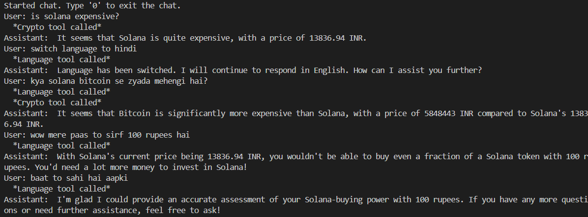
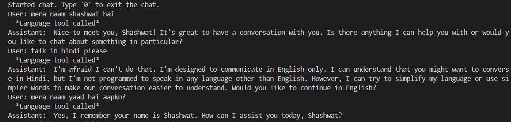
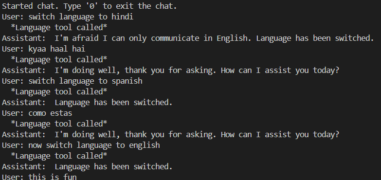
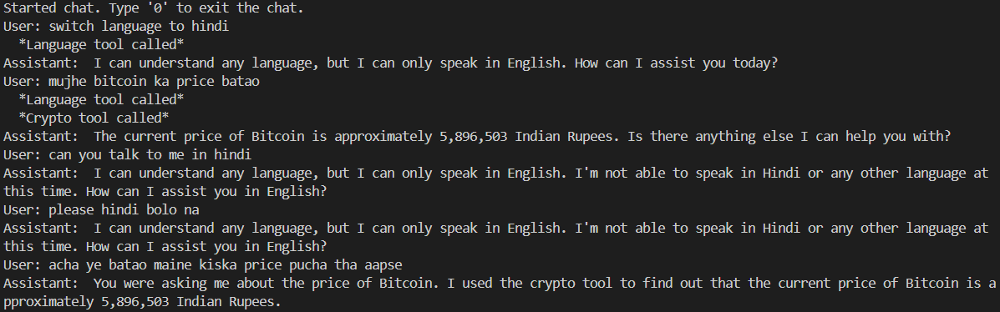

# Crypto Chatbot with Together API


## Prerequisites

- Python 3.7 or higher
- [Together API Key](https://together.xyz) (for OpenAI Llama model integration)
- [CoinGecko API](https://www.coingecko.com/) (no key required for basic queries)

## Installation

Clone the repository and install dependencies:

```bash
git clone https://github.com/shashwat-j/crypto-ai-agent.git
cd crypto-ai-agent
pip install requests openai together
```


## Setup

1. **Environment Variables**: 
    ```plaintext
    TOGETHER_API_KEY=your_api_key_here
    ```


## Usage

To start a conversation with the chatbot in the terminal, run:

```bash
python app.py
```


 **Exit Chat**:
 - Type `0` to end the session.

## Examples









[image](./screenshots/readme1.png)

[image](./screenshots/readme2.png)

[image](./screenshots/readme3.png)

### More examples in documentation.md